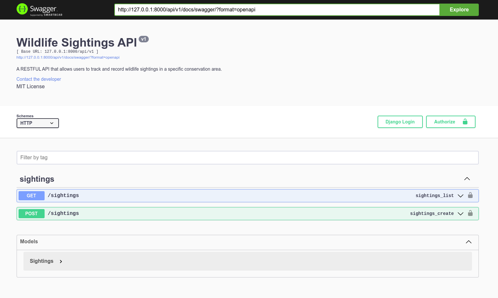
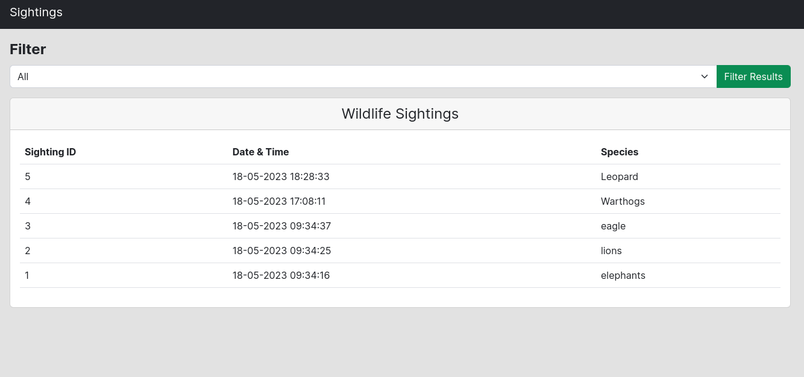

# Wildlife Sightings

A web-based application that allows users to track and record wildlife sightings in a specific conservation area. The application runs on a Django backend and a React frontend.

## Getting Started

- Type the following command in your terminal to clone this repository

```
git clone https://github.com/Edu58/Sightings.git
```

If you are using SSH, use the following command

```
git clone git@github.com:Edu58/Sightings.git
```


When you run the commands successfully, you should have a local version of this repository.

### Prerequisites

- A computer with Python 3 install. Check [here](https://realpython.com/installing-python/) for
  further [instructions](https://realpython.com/installing-python/)
- Access to the Internet
- An IDE of your choice e.g. Pycharm, VS Code, Sublime Text

### Installing

#### Backend


Navigate inside the API folder and create a .env file. Inside it add the following keys with their respective values as configured on your local machine:
```
SECRET_KEY=<Your Django Secret Key>
PGDATABASE=<Your Database Name>
PGUSER=<Your Database Username>
PGPASSWORD=<Your Database Password>
PGHOST=<Your Database Host. YOu can use 'localhost' if running the project locally>
PGPORT=<Your Database port. Will most likely be '5432'>
```
After this create a virtual enevironment and activate it. After this, run ```pip install -r requirements.txt``` to install the project dependencies. You can now run ```python manage.py runserver``` to start the server.  Once the server is running, open your browser and enter ```http://localhost:8000/api/v1/docs/swagger/``` in your url bar to view the Swagger documentation.

#### Frontend


Navigate inside the Frontend folder and run ```npm install``` to install the project dependencies. You can now run ```npm run dev``` to start the server.  Once the server is running, open your browser and enter ```http://http://localhost:5173/``` in your url bar to view the frontend.